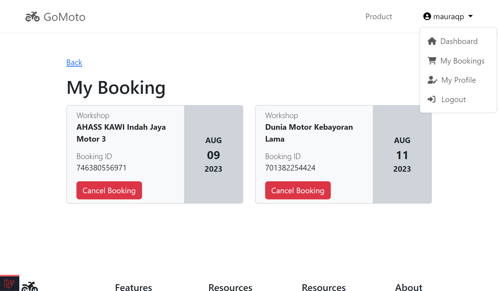

# goMoto
goMoto is a booking app that allows users to book motorcycle product online and see orders history. Users need to create an account to access features.

## Getting Started
These instructions will get you a copy of the project up and running on your local machine for development and testing purposes.
### Installation
Download zip / Clone the repo ```https://github.com/mauraqoonitah/goMoto.git```

## Running Application
- Migrate Database  ```php artisan migrate```

- Seed Database
1. ```php artisan db:seed --class=RoleSeeder```
2. ```php artisan db:seed --class=UserSeeder```
3. ```php artisan db:seed --4. class=WorkshopSeeder```
4. ```php artisan db:seed --6. class=MotorcycleSeeder```
5. ```php artisan db:seed --class=BookingSeeder```

## Database design


## Screenshot GoMoto (user)
#### Landing Page


#### Register & Login


#### Edit profile


#### Order a motorcycle product 


#### See my orders (Booking details, cancel or delete bookings)


## Screenshot GoMoto (admin)

#### Dashboard Admin


#### Show, Update, Delete Workshops List


#### Create new workshop


#### Show, Update, Delete products of workshop


### Create new products of workshop

